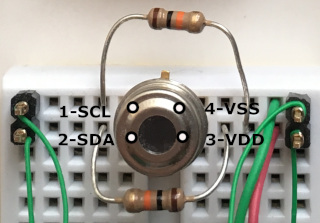
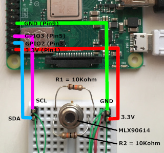

# Threejs-VR-Sensors (under construction)

A project to explore interfacing sensors into virtual reality with a Raspberry Pi.

## System Requirements

The types of sensors interfaced to a Raspberry Pi are dependent on what the author have. The project is more about examples of using I<sup>2</sup>C, SPI, and GPIO pins on a Raspberry Pi.<br>

Raspberry Pi with wireless LAN (tested Raspberry Pi 3 Model B+, Model A+, Pi Zero W).<br>

Raspbian Buster with desktop (tested February 2020, 1138 MB version) from:

[https://www.raspberrypi.org/downloads/raspbian/](https://www.raspberrypi.org/downloads/raspbian/)

There are three versions of Raspbian Buster. The 1138 MB version is chosen because it is half the size of the full version and without extra softwares not used in writing three.js codes and interfacing sensors. The Lite version is Linux text-only terminals and is not recommended as examples are shown with GUI and text.

After Raspbian is booted, select "Preferences/Raspberry Pi Configuration" and enable I<sup>2</sup>C and SPI.


A display, keyboard, mouse, and power supply for Raspberry Pi.

Oculus Quest optional (tested Quest Update >16.0 and three.js r115).<br>

## 1. Melexis Non-contact Infrared Thermometer MLX90614

There are two versions of MLX90614: 3V and 5V. The 3V version is selected because Raspberry Pi GPIO are 3.3V logic levels and NOT 5V tolerant.<br>

ALWAYS "sudo shutdown -h now", wait (eg. LED stop flashing, no hdmi signal), and power off Raspberry Pi before wiring sensors to GPIO pins.<br>

Use Raspberry Pi website to identify pins:

https://www.raspberrypi.org/documentation/usage/gpio/

For Raspberry Pi 3 B+, GPIO2 (Pin 3) is SDA and GPIO3 (Pin 5) is SCL. Pin 1 is 3.3V and Pin 9 is GND.<br>

Use links in References for information on MLX90614 pinout. A MLX90614 from adafruit comes with two 10k pull-up resistors for SDA and SCL.<br>

Here are two images of a wiring:<br>





With the MLX90614 correctly wired, power on the Raspberry Pi. In a Terminal, "sudo i2cdetect -y 1" and MLX90614 should appear at hex address 5a:


In Terminal, "pip install PyMLX90614". This also install smbus2-0.3.0 which can be used with the next sensor Lidar-Lite v2.


Try "from smbus2 import SMBus" and few other methods in python to check things. The temperature reading is in Celsius. For example, hand is ~22 degC and head is ~31 degC. Method "sensor.get_object_2()" gives -273.15 degC which is absolute zero Kelvin (calibration?).

Here is a python code to output temperature at 10Hz for 60min (for testing):

<pre>
#!/usr/bin/python

from smbus2 import SMBus
from mlx90614 import MLX90614
import time
from sys import stdout

bus = SMBus(1)
sensor = MLX90614(bus, address=0x5A)

for x in range(1,36000):
        print sensor.get_object_1()
        stdout.flush()
        time.sleep(0.1)
        
bus.close()
</pre>

Save the python script as heat.py.<br>

To display the output of heat.py in Raspberry Pi Chromium, one way is using websocketd.<br>

http://websocketd.com/

There is a Linux ARM version for the Raspberry Pi in "Download".<br>

Put websocketd in a directory with heat.py.<br>

In a Terminal, cd to that directory and type.<br>

<pre>
openssl req -newkey rsa:2048 -new -nodes -x509 -days 3650 -keyout key.pem -out cert.pem
</pre>

Test this minimal HTML websocket client.

```html

<!-- this is a comment 

-->

<!DOCTYPE html>
<html lang="en">
	<head>
		<meta charset="utf-8">
		<title>three.js Thermal Infrared</title>
		<style>
			body { margin: 0; }
			canvas { width: 100%; height: 100% }
		</style>		
	</head>
	<body>

<script>

init();

function init() {

	var ws = new WebSocket('wss://127.0.0.1:8000');		// localhost testing
//	var ws = new WebSocket('wss://192.168.4.1:8000');	// wireless testing

	ws.onopen = function() {
	console.log("websocket onopen");
	};

	ws.onclose = function() {
	console.log("websocket onclose");
	};

// Read output from heat.py
 
	ws.onmessage = function(event) {
	console.log(event.data);
	};

}

</script>				
</body>
</html>

```

In Terminal, type.<br>

<pre>
./websocket --port=8000 --sslkey=key.pem --sslcert=cert.pem --staticdir=. ./heat.py
</pre>


In Chromium, enter ```https://127.0.0.1:8000``` and may get a warning "Your connection is not private". Proceed in "Advanced" as you are connecting to your own Raspberry Pi.<br>


Measure temperature of an ice pack at ~ -10 degC.<br>


Next, configure the Pi as a wireless access point:<br>

https://www.raspberrypi.org/documentation/configuration/wireless/access-point-routed.md

In the "Configuring the access point host software (hostapd)", make own NameOfNetwork and good password for wpa_passphrase.<br>


## 2. Lidar-Lite v2

## References

Derek Molloy, Exploring Raspberry Pi, John Wiley & Sons (2016).

https://www.raspberrypi.org/

https://learn.adafruit.com/using-melexis-mlx90614-non-contact-sensors/wiring-and-test

https://www.adafruit.com/

https://learn.sparkfun.com/tutorials/mlx90614-ir-thermometer-hookup-guide/all

https://www.sparkfun.com/

https://www.melexis.com/en/product/MLX90614/Digital-Plug-Play-Infrared-Thermometer-TO-Can

https://pypi.org/project/PyMLX90614/

https://pypi.org/project/smbus2/

https://github.com/joewalnes/websocketd

<br>Copyright (c) 2020 Hartwell Fong
