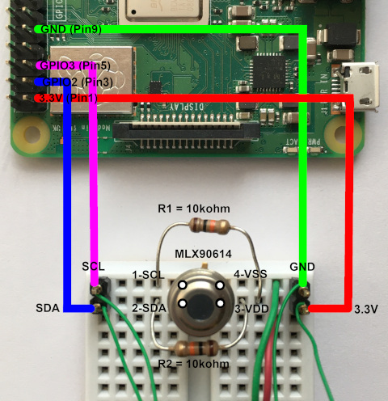
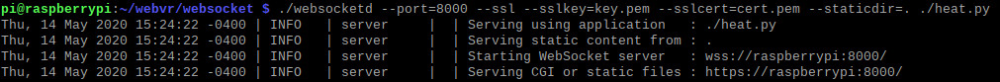
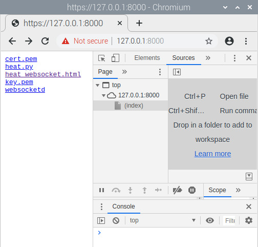
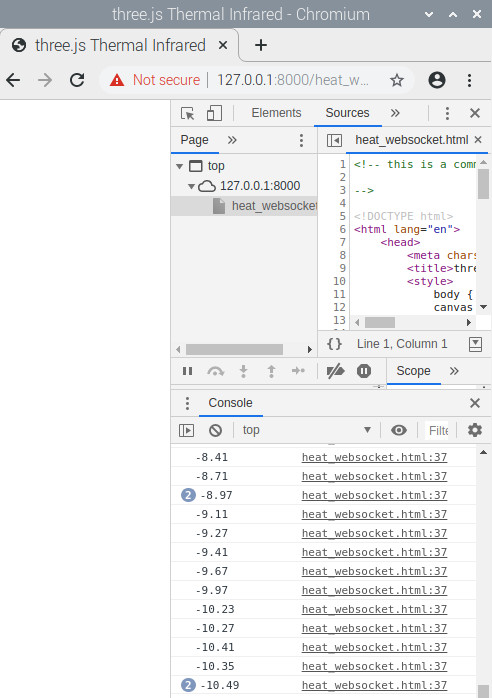
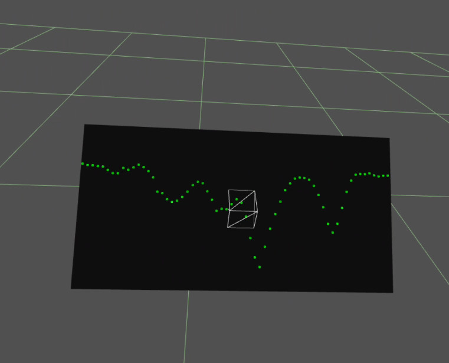
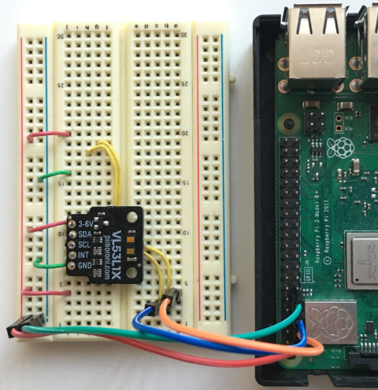
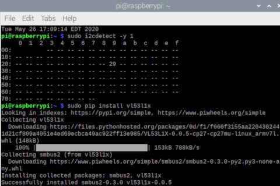
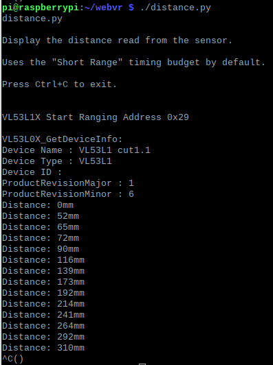
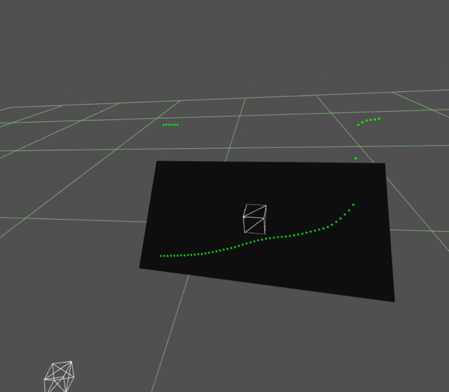

# Threejs-VR-Sensors

A project to explore interfacing sensors into virtual reality with a Raspberry Pi.<br>

This involves programming (python, javascript) I<sup>2</sup>C pins on a Raspberry Pi. Data read from sensors are sent to wifi-connected devices (eg. Oculus Quest) using websocket.<br>

## System Requirements

Raspberry Pi with wireless LAN (tested Raspberry Pi 3 Model B+, Pi 3 Model A+, Pi Zero W).<br>
Oculus Quest (tested Quest Update >17.0 and three.js r115).<br>

Raspbian Buster with desktop (tested February 2020, 1138 MB version) from:

[https://www.raspberrypi.org/downloads/raspbian/](https://www.raspberrypi.org/downloads/raspbian/)

There are three versions of Raspbian Buster. The 1138 MB version is chosen because it is half the size of the full version and without extra softwares not used in writing three.js codes and interfacing sensors. The Lite version is Linux text-only and is not recommended as examples are shown with GUI and text. However, Lite is excellent for a minimal low overhead headless Linux access point after testing on full version.

After Raspbian is booted, select "Preferences/Raspberry Pi Configuration" and enable I<sup>2</sup>C and SPI. (So far, sensors are I<sup>2</sup>C. Sensors with SPI could be used in future projects.)


A display, keyboard, mouse, and power supply for Raspberry Pi.

## 1. Melexis MLX90614 Non-contact Infrared Thermometer

There are two versions of MLX90614: 3V and 5V. The 3V version is selected because Raspberry Pi GPIO are 3.3V logic levels and NOT 5V tolerant.<br>

ALWAYS "sudo shutdown -h now", wait (eg. LED stop flashing, no hdmi signal), and power off Raspberry Pi before wiring sensors to GPIO pins.<br>

Use Raspberry Pi website to identify pins:

https://www.raspberrypi.org/documentation/usage/gpio/

For Raspberry Pi 3 B+, GPIO2 (Pin 3) is SDA and GPIO3 (Pin 5) is SCL. Pin 1 is 3.3V and Pin 9 is GND.<br>

Use links in References for information on MLX90614 pinout. A MLX90614 from adafruit comes with two 10k pull-up resistors for SDA and SCL.<br>

Here is an example of a wiring:<br>



With the MLX90614 correctly wired, power on the Raspberry Pi. In a Terminal, "sudo i2cdetect -y 1" and MLX90614 should appear at hex address 5a:


In Terminal, "pip install PyMLX90614". This also install smbus2-0.3.0 which is used with other I<sup>2</sup>C sensors.


Try "from smbus2 import SMBus" and few other methods in python to check things. The temperature reading is in Celsius. For example, hand is ~22 degC and head is ~31 degC. Method "sensor.get_object_2()" gives -273.15 degC which is absolute zero Kelvin (calibration?).

Here is a python code to output temperature at 10Hz for 5min (for testing):

<pre>
#!/usr/bin/python

from smbus2 import SMBus
from mlx90614 import MLX90614
import time
from sys import stdout

bus = SMBus(1)
sensor = MLX90614(bus, address=0x5A)

for x in range(1,3000):
        print sensor.get_object_1()
        stdout.flush()
        time.sleep(0.1)
        
bus.close()
</pre>

Save the python script as heat.py.<br>

To display the output of heat.py in Raspberry Pi Chromium, one way is using websocketd.<br>

http://websocketd.com/

There is a Linux ARM version for the Raspberry Pi in "Download".<br>

Put websocketd in a directory with heat.py.<br>

In a Terminal, cd to that directory and type.<br>

<pre>
openssl req -newkey rsa:2048 -new -nodes -x509 -days 3650 -keyout key.pem -out cert.pem
</pre>

This generates two files key.pem and cert.pem in the current directory.<br>

Test this minimal HTML websocket client.<br>

```html

<!-- a comment 

-->

<!DOCTYPE html>
<html lang="en">
	<head>
		<meta charset="utf-8">
		<title>three.js Thermal Infrared</title>
		<style>
			body { margin: 0; }
			canvas { width: 100%; height: 100% }
		</style>		
	</head>
	<body>

<script>

init();

function init() {

	var ws = new WebSocket('wss://127.0.0.1:8000');		// localhost testing
//	var ws = new WebSocket('wss://192.168.4.1:8000');	// wireless testing

	ws.onopen = function() {
	console.log("websocket onopen");
	};

	ws.onclose = function() {
	console.log("websocket onclose");
	};

// Read output from heat.py
 
	ws.onmessage = function(event) {
	console.log(event.data);
	};

}

</script>				
</body>
</html>

```

In Terminal, type.<br>

<pre>
./websocketd --port=8000 --sslkey=key.pem --sslcert=cert.pem --staticdir=. ./heat.py
</pre>



In Chromium, enter ```https://127.0.0.1:8000``` and may get a warning "Your connection is not private". Proceed in "Advanced" as you are connecting to your own Raspberry Pi.<br>



Measure temperature of an ice pack at ~ -10 degC.<br>



With python heat.py and websocketd working, configure the Pi as a wireless access point for connecting wifi devices like Oculus Quest:<br>

https://www.raspberrypi.org/documentation/configuration/wireless/access-point-routed.md

In "Configure the access point software", make own NameOfNetwork and good password for wpa_passphrase. The author skips section "Enable routing and IP masquerading" to keep thing simple (so no internet access from Pi wireless LAN but apt-get work with ethernet). This is useful in developing and serving three.js from a Raspberry Pi with Oculus Quest wifi connected.<br>

All codes in Threejs-VR-Physics are developed on a Raspberry Pi 3 Model B+ and tested with Oculus Quest. Use section "Making Threejs-WebXR-67P" to install (or skip) three.js on Raspberry Pi:<br>

https://github.com/Physicslibrary/Threejs-WebXR-67P

However, three.js installation is a ~250MB download. An easier way is to use "build/three.module.js.", "examples/jsm/VRButton.js", "examples/jsm/VRButton.d.ts" from:<br>

https://github.com/Physicslibrary/Threejs-VR-Physics

These are minimal three.js files for VR. Create the same file structures and put them in the same directory as earlier "heat_websocket.html".<br>

Put threejs_vr_mlx90614_handheld_plot.html in "examples" folder. Comment out "var ws\*127.0.0.1\*" and uncomment "var ws = new WebSocket('wss://192.168.4.1:8000');".<br>

With Oculus Quest connected to the Pi and websocketd running heat.py, open Oculus Browser to ```https://192.168.4.1:8000```. Find threejs_vr_mlx90614_handheld_plot.html and "Enter VR".<br>



Above is a temperature plot attached to right Touch controller. The oscillating wave is an ice pack moving back and forth in front of the MLX90614.<br>

(Plot stops after 5 min because heat.py run at 10Hz for 3000 samples, refresh threejs_vr_mlx90614_handheld_plot.html to restart)<br>

## 2. Pimoroni VL53L1X Time-of-Flight Sensor







Run "python distance.py" from examples (May 27, 2020) in https://github.com/pimoroni/vl53l1x-python. The above shows an object moving at discrete distances from the sensor.<br>

Modify distance.py to this example (vl53l1x.py) to output data in meters:

<pre>
#!/usr/bin/env python

import time
import sys
import signal
import VL53L1X

tof = VL53L1X.VL53L1X(i2c_bus=1, i2c_address=0x29)
tof.open()

tof.set_timing(66000, 70)

tof.start_ranging(1)

running = True

def exit_handler(signal, frame):
    global running
    running = False
    tof.stop_ranging()
    print()
    sys.exit(0)

signal.signal(signal.SIGINT, exit_handler)

while running:
	distance_in_mm = tof.get_distance()
	print(distance_in_mm / 1000.0)	# mm to m
	sys.stdout.flush()
</pre>

(June 8, 2020)<br>
Look like filter.py is not necessary as data is not buffered. It may be that after websocketd is running with a python script, the eight lines of string have passed and parseFloat(event.data) in websocket client threejs_vr_vl53l1x_handheld_plot.html is converting strings to floating-points.<br>

Archived:<br>
{

Method "tof.open()" outputs eight lines of information about sensor. Pipe the output of vl53l1x.py to this python script (filter.py) to remove those lines and output distance (eg. ./vl53l1x.py | ./filter.py):

<pre>
#!/usr/bin/python

import sys

for i in range(10):	# ignore first ten lines
	sys.stdin.readline()

while True:
	sys.stdout.write(sys.stdin.readline())
	sys.stdout.flush()
</pre>

Make two python scripts to one (eg. vl53l1x.sh) for websocketd:

<pre>
#!/bin/bash
./vl53l1x.py | ./filter.py
</pre>

}


Same as for MLX90614, run websocketd, and Oculus Browser to threejs_vr_vl53l1x_handheld_plot.html.

<pre>
./websocketd --port=8000 --sslkey=key.pem --sslcert=cert.pem --staticdir=. ./vl53l1x.py
</pre>



Above is a distance plot attached to right Touch controller. The linear increasing curve is an object moving away in front of the VL53L1X from 0m to 1m (about half of y-axis) to maximum of 3m (background).<br>

## 3.

## References

Derek Molloy, Exploring Raspberry Pi, John Wiley & Sons (2016).

https://www.raspberrypi.org/

https://learn.adafruit.com/using-melexis-mlx90614-non-contact-sensors/wiring-and-test

https://learn.sparkfun.com/tutorials/mlx90614-ir-thermometer-hookup-guide/all

https://www.melexis.com/en/product/MLX90614/Digital-Plug-Play-Infrared-Thermometer-TO-Can

https://pypi.org/project/PyMLX90614/

https://pypi.org/project/smbus2/

https://github.com/joewalnes/websocketd

https://shop.pimoroni.com/products/vl53l1x-breakout

https://github.com/pimoroni/vl53l1x-python

<br>Copyright (c) 2020 Hartwell Fong
