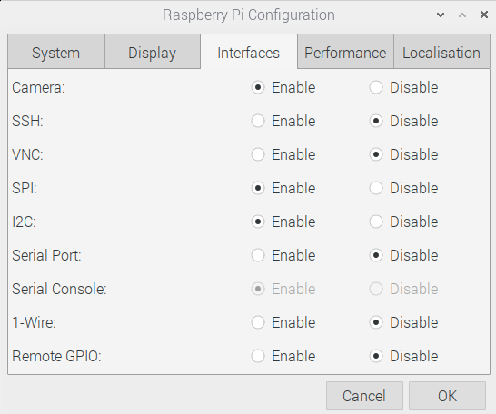
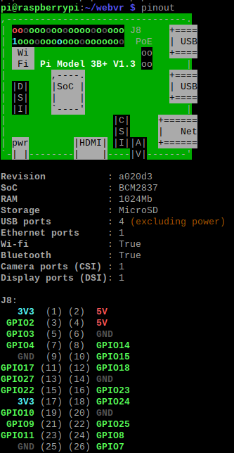
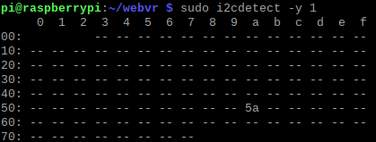
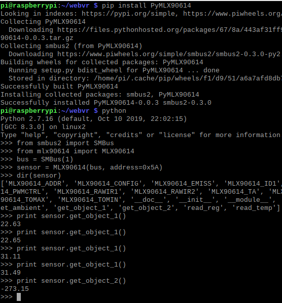

# Threejs-VR-Sensors (under construction)

A project to explore a way to interface different sensors into virtual reality with a Raspberry Pi.

## System Requirements

The types of sensors interfaced to a Raspberry Pi is dependent on what the author have. The project is more about examples of using I2C, SPI, and GPIO pins on a Raspberry Pi. 

Raspberry Pi with wireless LAN (tested Raspberry Pi 3 Model B+, Model A+, Pi Zero W). 

Raspbian Buster with desktop (tested February 2020, 1138 MB version) from:

[https://www.raspberrypi.org/downloads/raspbian/](https://www.raspberrypi.org/downloads/raspbian/)

There are three versions of Raspbian Buster. No reason for choosing the 1138 MB version except it is half the size of the full version. The Lite version is Linux text-only terminals and is not recommended as most examples are shown with a GUI.

After Raspbian is booted, select "Preferences/Raspberry Pi Configuration" and enable I2C and SPI.

A display, keyboard, mouse, and power supply for Raspberry Pi.

Oculus Quest optional (tested Quest Update >16.0 and three.js r115). 

## 1. Melexis Infrared thermometer MLX90614

## 2. Lidar-Lite v2

## References

Derek Molloy, Exploring Raspberry Pi, John Wiley & Sons (2016).

https://pypi.org/project/PyMLX90614/

https://pypi.org/project/smbus2/

https://www.raspberrypi.org/

https://www.adafruit.com/

https://www.sparkfun.com/

 Copyright (c) 2020 Hartwell Fong
